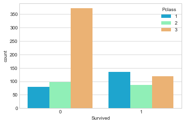
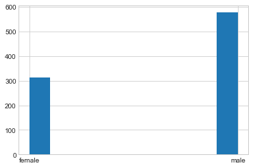

# Exploratory Data Analysis

Reading sample data 


```python
import pandas as pd
import numpy as np
import matplotlib.pyplot as plt
import seaborn as sns
%matplotlib inline
```


```python
train = pd.read_csv('titanic_train.csv')
```


```python
train.info()
```

    <class 'pandas.core.frame.DataFrame'>
    RangeIndex: 891 entries, 0 to 890
    Data columns (total 12 columns):
    PassengerId    891 non-null int64
    Survived       891 non-null int64
    Pclass         891 non-null int64
    Name           891 non-null object
    Sex            891 non-null object
    Age            714 non-null float64
    SibSp          891 non-null int64
    Parch          891 non-null int64
    Ticket         891 non-null object
    Fare           891 non-null float64
    Cabin          204 non-null object
    Embarked       889 non-null object
    dtypes: float64(2), int64(5), object(5)
    memory usage: 83.6+ KB
    

There are missing values in above data e.g. Cabin, Age

## Missing Data
We can use seaborn to create a simple heatmap to see where we are missing data!


```python
sns.heatmap(train.isnull(),yticklabels=False,cbar=False,cmap='viridis')
```


    <matplotlib.axes._subplots.AxesSubplot at 0x1ae43c43c18>


Roughly 20 percent of the Age data is missing. The proportion of Age missing is likely small enough for reasonable replacement with some form of imputation. Looking at the Cabin column, it looks like we are just missing too much of that data to do something useful with at a basic level. We'll probably drop this later, or change it to another feature like "Cabin Known: 1 or 0"

Let's continue on by visualizing some more of the data! Check out the video for full explanations over these plots, this code is just to serve as reference.


```python
sns.set_style('whitegrid')
sns.countplot(x='Survived',data=train,palette='RdBu_r')
```


    <matplotlib.axes._subplots.AxesSubplot at 0x1ae43c86f60>


```python
sns.set_style('whitegrid')
sns.countplot(x='Survived',hue='Pclass',data=train,palette='rainbow')
```


    <matplotlib.axes._subplots.AxesSubplot at 0x1ae440b87f0>





```python
# sns.distplot(train['Sex']) # To plot distribution for any int data
```


```python
# Using sns distplot have to drop na values
sns.distplot(train['Age'].dropna(),kde=False,color='darkred',bins=30)
```


    <matplotlib.axes._subplots.AxesSubplot at 0x1ae4483aeb8>


```python
train['Age'].hist(bins=30,color='darkred',alpha=0.7)
```


    <matplotlib.axes._subplots.AxesSubplot at 0x1ae44856c50>


```python
# Pandas hist functions is quite useful and simple to use
train['Sex'].hist()
```


    <matplotlib.axes._subplots.AxesSubplot at 0x1ae449014a8>





```python
# Count plot
sns.countplot(x='SibSp',data=train)
```


    <matplotlib.axes._subplots.AxesSubplot at 0x1ae449ff6a0>


```python
# sns.pairplot(train)
```


```python
sns.heatmap(train.corr())
```


    <matplotlib.axes._subplots.AxesSubplot at 0x1ae45bbe588>


```python
train.describe()
```


<div>
<style>
    .dataframe thead tr:only-child th {
        text-align: right;
    }

    .dataframe thead th {
        text-align: left;
    }

    .dataframe tbody tr th {
        vertical-align: top;
    }
</style>
<table border="1" class="dataframe">
  <thead>
    <tr style="text-align: right;">
      <th></th>
      <th>PassengerId</th>
      <th>Survived</th>
      <th>Pclass</th>
      <th>Age</th>
      <th>SibSp</th>
      <th>Parch</th>
      <th>Fare</th>
    </tr>
  </thead>
  <tbody>
    <tr>
      <th>count</th>
      <td>891.000000</td>
      <td>891.000000</td>
      <td>891.000000</td>
      <td>714.000000</td>
      <td>891.000000</td>
      <td>891.000000</td>
      <td>891.000000</td>
    </tr>
    <tr>
      <th>mean</th>
      <td>446.000000</td>
      <td>0.383838</td>
      <td>2.308642</td>
      <td>29.699118</td>
      <td>0.523008</td>
      <td>0.381594</td>
      <td>32.204208</td>
    </tr>
    <tr>
      <th>std</th>
      <td>257.353842</td>
      <td>0.486592</td>
      <td>0.836071</td>
      <td>14.526497</td>
      <td>1.102743</td>
      <td>0.806057</td>
      <td>49.693429</td>
    </tr>
    <tr>
      <th>min</th>
      <td>1.000000</td>
      <td>0.000000</td>
      <td>1.000000</td>
      <td>0.420000</td>
      <td>0.000000</td>
      <td>0.000000</td>
      <td>0.000000</td>
    </tr>
    <tr>
      <th>25%</th>
      <td>223.500000</td>
      <td>0.000000</td>
      <td>2.000000</td>
      <td>20.125000</td>
      <td>0.000000</td>
      <td>0.000000</td>
      <td>7.910400</td>
    </tr>
    <tr>
      <th>50%</th>
      <td>446.000000</td>
      <td>0.000000</td>
      <td>3.000000</td>
      <td>28.000000</td>
      <td>0.000000</td>
      <td>0.000000</td>
      <td>14.454200</td>
    </tr>
    <tr>
      <th>75%</th>
      <td>668.500000</td>
      <td>1.000000</td>
      <td>3.000000</td>
      <td>38.000000</td>
      <td>1.000000</td>
      <td>0.000000</td>
      <td>31.000000</td>
    </tr>
    <tr>
      <th>max</th>
      <td>891.000000</td>
      <td>1.000000</td>
      <td>3.000000</td>
      <td>80.000000</td>
      <td>8.000000</td>
      <td>6.000000</td>
      <td>512.329200</td>
    </tr>
  </tbody>
</table>
</div>


```python
#plt.scatter(a,b)
```
